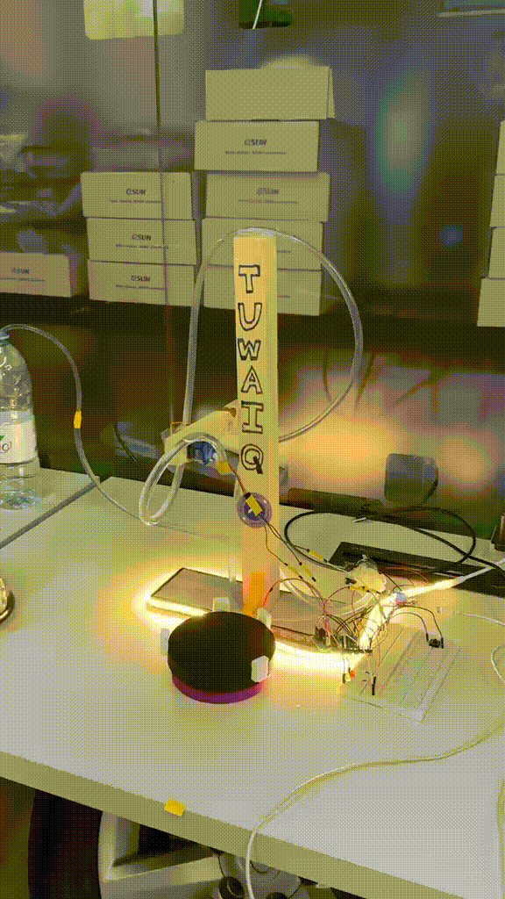

# V6O Project

The V6O project is based on making a V60-style drip machine. 

## Components
* 12V water pump.
* Servo.
* ULN2003.
* Arduino Nano ESP32.
* Relay.
* Button.
* kettle.
* Dripper.
* Rotating plate that spins the dripper.
* Two small hoses.

## Requirements
* C++17 or newer.
* [Arduino IDE](https://www.arduino.cc/en/software) with the [ESP32 board package](https://github.com/espressif/arduino-esp32).
* [Stepper](https://github.com/arduino-libraries/Stepper) library.
* [ESP32Servo](https://github.com/madhephaestus/ESP32Servo) library.

## Getting started
1. Install the ESP32 board package then the two libraries from the Library Manager.
2. Rename `src/secrets.example.h` to `src/secrets.h` and type network name and password.
3. Open `V6O.ino`, the folder and the sketch must have the same name.
4. Open the serial monitor and note the address the device prints.
5. Put that address in `DEVICE` at `UI/script.js`.
6. Open `UI/index.html` in your browser.

## Process
### Starts in a specific way.
1. **First Way:**
- Press the button on the hardware side and it will start automaticly in default process.

2. **Second Way:**
- using the UI that is included to chose the pours and the time between pours and the amount of time waiting between pours.

## Showcase Video

  

